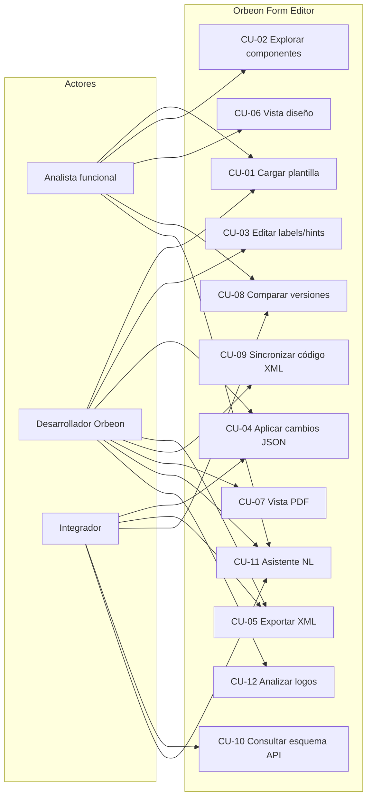

# Casos de uso

**Proyecto:** Orbeon Form Editor

---

## Actores

| Actor | Descripción |
|-------|-------------|
| **Analista funcional** | Conoce el formulario de negocio; revisa labels, secciones y comparaciones entre versiones. |
| **Desarrollador Orbeon** | Mantiene plantillas XML; edita recursos, binds y exporta cambios. |
| **Integrador / DevOps** | Consume la API REST desde pipelines o scripts de automatización. |
| **Sistema Orbeon** | (Externo) Origen de las plantillas XML; destino del XML exportado. |

---

## Diagrama de casos de uso

Ver [diagramas/casos-uso.puml](diagramas/casos-uso.puml).

---

## CU-01 — Cargar plantilla XML

| Campo | Valor |
|-------|-------|
| **ID** | CU-01 |
| **Actor** | Analista funcional, Desarrollador |
| **Descripción** | El usuario selecciona un archivo XML exportado de Orbeon y el sistema lo parsea. |
| **Precondiciones** | Aplicación en ejecución; archivo XML válido Orbeon. |
| **Flujo principal** | 1. Usuario pulsa «Cargar XML base». 2. Selecciona archivo `.xml` o `.txt`. 3. Frontend envía `POST /api/formulario/cargar`. 4. Backend parsea XML, extrae componentes y estructura. 5. UI muestra lista, secciones y vista diseño. |
| **Postcondiciones** | XML en memoria del cliente; componentes disponibles para edición. |
| **Alternativas** | XML mal formado → mensaje de error. |
| **Requisitos** | RF-001, RF-002, RF-003, RF-040 |

---

## CU-02 — Explorar componentes

| Campo | Valor |
|-------|-------|
| **ID** | CU-02 |
| **Actor** | Analista funcional |
| **Descripción** | Navegar la lista plana o la vista por secciones con búsqueda. |
| **Precondiciones** | CU-01 completado. |
| **Flujo principal** | 1. Usuario abre pestaña «Lista» o «Secciones». 2. Escribe en el buscador. 3. El sistema filtra en tiempo real. |
| **Postcondiciones** | Usuario localiza el campo deseado. |
| **Requisitos** | RF-010, RF-011, RF-012 |

---

## CU-03 — Editar labels y hints

| Campo | Valor |
|-------|-------|
| **ID** | CU-03 |
| **Actor** | Desarrollador Orbeon |
| **Descripción** | Modificar textos de un campo desde la interfaz guiada. |
| **Precondiciones** | CU-01 completado. |
| **Flujo principal** | 1. Usuario localiza componente en lista. 2. Edita label y/o hint en los inputs. 3. Sistema acumula cambio en changelog local. 4. Al exportar o aplicar, se actualiza `fr-form-resources`. |
| **Postcondiciones** | Cambios pendientes en sesión; XML actualizado tras exportar. |
| **Requisitos** | RF-020, RF-021, RF-024 |

---

## CU-04 — Aplicar modificaciones JSON

| Campo | Valor |
|-------|-------|
| **ID** | CU-04 |
| **Actor** | Desarrollador, Integrador |
| **Descripción** | Aplicar un lote de cambios tipados mediante JSON `changes[]`. |
| **Precondiciones** | XML cargado o disponible en petición. |
| **Flujo principal** | 1. Usuario abre pestaña «Modificar JSON». 2. Pega JSON con array `changes` o carga fichero `.json`. 3. Pulsa «Aplicar cambios» → `POST /api/formulario/modificar`. 4. Backend aplica cada cambio al DOM. 5. UI muestra log y actualiza XML/componentes. |
| **Extensiones** | Tipos: `update-label`, `update-hint`, `update-image`, `hide-section`, etc. |
| **Alternativas** | Tipo desconocido → entrada en log con ✗. |
| **Requisitos** | RF-022, RF-023, RF-045 |

---

## CU-05 — Exportar XML modificado

| Campo | Valor |
|-------|-------|
| **ID** | CU-05 |
| **Actor** | Desarrollador, Integrador |
| **Descripción** | Descargar el XML resultante con todas las modificaciones. |
| **Precondiciones** | XML cargado; opcionalmente modificaciones en changelog o JSON. |
| **Flujo principal** | 1. Usuario pulsa «Exportar XML de Salida». 2. `POST /api/formulario/exportar` con `xmlActual` y opcional `modificaciones`. 3. Navegador descarga `orbeon_formulario_modificado.xml`. |
| **Postcondiciones** | Archivo XML listo para importar en Orbeon. |
| **Requisitos** | RF-006, RF-026, RF-042 |

---

## CU-06 — Visualizar vista diseño

| Campo | Valor |
|-------|-------|
| **ID** | CU-06 |
| **Actor** | Analista funcional |
| **Descripción** | Previsualizar el formulario como lo vería el usuario final (aproximación). |
| **Precondiciones** | CU-01 completado. |
| **Flujo principal** | 1. Usuario abre panel derecho «Vista Diseño». 2. Sistema renderiza cada componente según tipo. 3. Desplegables estáticos muestran `<select>` con opciones. 4. Desplegables dinámicos muestran aviso de servicio externo. |
| **Requisitos** | RF-013, RF-014, RF-015 |

---

## CU-07 — Generar vista PDF

| Campo | Valor |
|-------|-------|
| **ID** | CU-07 |
| **Actor** | Desarrollador, Analista |
| **Descripción** | Obtener PDF de previsualización del formulario. |
| **Precondiciones** | CU-01 completado. |
| **Flujo principal** | 1. Cliente llama `POST /api/formulario/vista-pdf` con XML actual (y opcionalmente preset de instancia). 2. El servidor devuelve bytes PDF. 3. *(UI retirada junio 2026)* Antes se mostraba en iframe; hoy solo vía API o herramientas externas. |
| **Limitación** | No es el PDF real de Orbeon; excluye `noprintinpdf`. Restaurar pestaña en UI: ver [M-010](12-roadmap-mejoras.md). |
| **Requisitos** | RF-017, RF-043 |

---

## CU-08 — Comparar versiones de plantilla

| Campo | Valor |
|-------|-------|
| **ID** | CU-08 |
| **Actor** | Analista, Integrador |
| **Descripción** | Detectar diferencias entre dos plantillas XML. |
| **Precondiciones** | Dos archivos XML Orbeon. |
| **Flujos** | **8a.** Con XML base cargado → «Comparar con otro XML». **8b.** Sin carga previa → «Comparar 2 archivos…» (modal). |
| **Flujo principal** | 1. Usuario selecciona archivo(s) comparación. 2. `POST /api/formulario/comparar`. 3. Modal muestra resumen y detalle por componente (añadido/eliminado/modificado). |
| **Postcondiciones** | Usuario identifica cambios entre PRE y v39, por ejemplo. |
| **Requisitos** | RF-030 a RF-034, RF-044 |

---

## CU-09 — Sincronizar código XML manual

| Campo | Valor |
|-------|-------|
| **ID** | CU-09 |
| **Actor** | Desarrollador |
| **Descripción** | Tras editar XML en pestaña código, reparsear el modelo. |
| **Precondiciones** | XML cargado; usuario edita textarea XML. |
| **Flujo principal** | 1. Usuario modifica XML en «Código XML». 2. Pulsa «Sincronizar». 3. `POST /api/formulario/sincronizar-codigo`. 4. Listas y vista diseño se actualizan. |
| **Requisitos** | RF-005, RF-041 |

---

## CU-10 — Consultar esquema de modificaciones

| Campo | Valor |
|-------|-------|
| **ID** | CU-10 |
| **Actor** | Integrador |
| **Descripción** | Obtener documentación machine-readable del formato `changes[]`. |
| **Flujo principal** | `GET /api/formulario/esquema-modificaciones` → JSON con tipos y ejemplo. |
| **Requisitos** | RF-025 |

---

## CU-11 — Asistente en lenguaje natural

| Campo | Valor |
|-------|-------|
| **ID** | CU-11 |
| **Actor** | Analista, Desarrollador, Integrador |
| **Descripción** | Consultar o modificar el XML escribiendo instrucciones en español. |
| **Precondiciones** | XML cargado (para modificaciones). |
| **Flujo principal** | 1. Usuario abre pestaña «Asistente». 2. Escribe instrucción (ej. «¿Cuántos logos tiene?»). 3. `POST /api/formulario/lenguaje-natural`. 4. Sistema interpreta intención, aplica `changes[]` si procede. 5. Muestra respuesta en panel visible y tarjetas clicables; historial de chat. 6. Clic en tarjeta → editor CRUD + XML localizado (CU-13). |
| **Extensiones** | Logos, desplegables CRUD, labels/hints. |
| **Requisitos** | RF-050 a RF-058, RF-065, RF-046 |

---

## CU-12 — Analizar logos con posición

| Campo | Valor |
|-------|-------|
| **ID** | CU-12 |
| **Actor** | Desarrollador |
| **Descripción** | Obtener inventario estructurado de logos/imágenes del formulario. |
| **Flujo principal** | `POST /api/formulario/analizar-logos` con `{ xml }` → `{ total, descripcion, logos[] }`. |
| **Requisitos** | RF-051, RF-047 |

---

## CU-13 — Editor CRUD contextual con previsualización

| Campo | Valor |
|-------|-------|
| **ID** | CU-13 |
| **Actor** | Analista, Desarrollador |
| **Descripción** | Editar un elemento del formulario (logo, campo, sección) navegando desde un resultado de la UI, con previsualización antes de confirmar en el XML. |
| **Precondiciones** | XML cargado. |
| **Flujo principal** | 1. Usuario pulsa un resultado (tarjeta Asistente, componente en Lista, sección, dependencia o imagen). 2. UI cambia a Código XML con fragmento seleccionado. 3. Se muestra `#panelEditorCrud` con campos editables. 4. Usuario modifica valores → **Previsualizar** → Vista Diseño con borrador (banner ámbar). 5. Usuario **Aplica al XML** o **Descarta** vista previa. 6. Changelog y vistas se actualizan si aplicó. |
| **Flujos alternativos** | **Ver en XML** sin cambiar pestaña activa del panel derecho; edición inline en Dependencias sin pasar por preview. |
| **Requisitos** | RF-060 a RF-065 |

---

## CU-14 — Analizar y editar calculadoras XForms

| Campo | Valor |
|-------|-------|
| **ID** | CU-14 |
| **Actor** | Desarrollador, Analista |
| **Descripción** | Inventariar `xf:bind @calculate`, ver fuentes de datos referenciadas y editar o eliminar expresiones. |
| **Precondiciones** | XML cargado. |
| **Flujo principal** | 1. Usuario carga plantilla → respuesta incluye `calculadoras` (o fallback `POST /analizar-calculadoras`). 2. Pestaña **Calculadoras**: listado, filtros por tipo/fuente, glosario. 3. Clic en tarjeta → editor CRUD (`calculadora`) + XML localizado (CU-13). 4. Edición inline o **Quitar calculate** → `update-calculator` vía `/modificar`. 5. Exportar XML modificado. |
| **Flujos alternativos** | Edición en Código XML o pestaña Modificar JSON (`update-bind` / `update-calculator`). |
| **Requisitos** | RF-070 a RF-076, RF-048, RF-061 |

---

## Matriz trazabilidad (resumen)

| Caso de uso | Requisitos funcionales principales |
|-------------|-----------------------------------|
| CU-01 | RF-001, RF-002, RF-003 |
| CU-02 | RF-010, RF-011, RF-012 |
| CU-03 | RF-020, RF-021 |
| CU-04 | RF-022, RF-023 |
| CU-05 | RF-006, RF-026 |
| CU-06 | RF-013, RF-014, RF-015 |
| CU-07 | RF-017 |
| CU-08 | RF-030–RF-034 |
| CU-09 | RF-005 |
| CU-10 | RF-025 |
| CU-11 | RF-050–RF-058, RF-065 |
| CU-12 | RF-051, RF-047 |
| CU-13 | RF-060–RF-065 |
| CU-14 | RF-070–RF-076, RF-048 |
