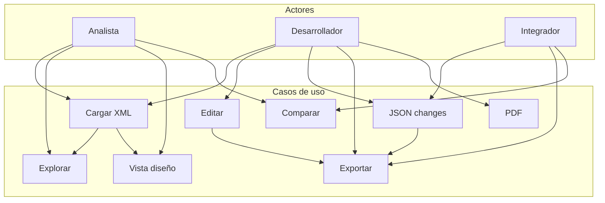
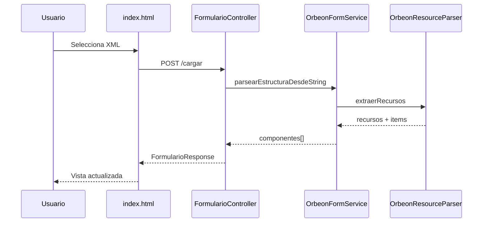

# Diagramas UML

Fuentes en formato **PlantUML** (`.puml`). Puedes visualizarlos con:

- Extensión **PlantUML** en VS Code / Cursor
- [PlantUML Online Server](https://www.plantuml.com/plantuml/uml/)
- CLI: `java -jar plantuml.jar docs/diagramas/*.puml`

## Índice de diagramas

| Archivo | Tipo UML | Descripción |
|---------|----------|-------------|
| [casos-uso.puml](casos-uso.puml) | Casos de uso | Actores y CU-01 a CU-10 |
| [clases-dominio.puml](clases-dominio.puml) | Clases | Modelo `model.*` y DTOs |
| [arquitectura-componentes.puml](arquitectura-componentes.puml) | Componentes | Capas Spring Boot |
| [secuencia-cargar-xml.puml](secuencia-cargar-xml.puml) | Secuencia | CU-01 Cargar plantilla |
| [secuencia-modificar-exportar.puml](secuencia-modificar-exportar.puml) | Secuencia | CU-04 / CU-05 Modificar y exportar |
| [secuencia-comparar.puml](secuencia-comparar.puml) | Secuencia | CU-08 Comparar versiones |
| [secuencia-lenguaje-natural.puml](secuencia-lenguaje-natural.puml) | Secuencia | CU-11 Asistente NL |
| [despliegue.puml](despliegue.puml) | Despliegue | JVM, navegador, archivos |

## Vista previa Mermaid (casos de uso simplificado)

## Vista previa Mermaid (secuencia cargar)

